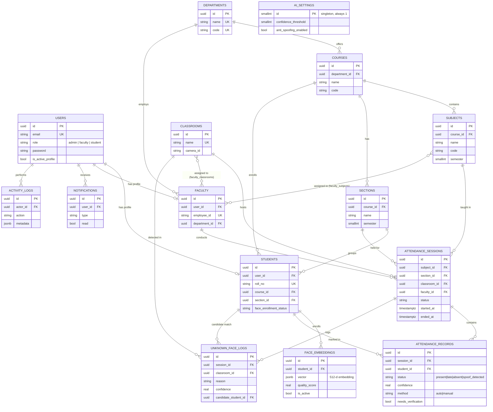

# AttendAI — Entity Relationship Diagram

Mirrors `schema.sql`. Paste the block below into any Mermaid renderer (GitHub renders it
natively, or use https://mermaid.live) to view it visually.

## Design notes

- **UUID primary keys** everywhere, matching the Django models (`models.UUIDField`) — avoids
  exposing sequential IDs and simplifies merging data from multiple camera/classroom sources.
- **`face_embeddings.vector` as JSONB**: portable across any Postgres install with no extra
  extensions. If you enable `pgvector`, switch this column to `VECTOR(512)` and add an
  IVFFlat/HNSW index — worthwhile once you're matching against an entire institution's
  roster rather than one section (tens of students) per live session.
- **`attendance_records` is unique per `(session_id, student_id)`**: a session is pre-seeded
  with one `absent` record per student in the section when it starts, then flipped to
  `present`/`late` as the AI recognizes faces — so the roster is always complete, never
  missing no-shows.
- **`ai_settings` is a singleton table** (`id` constrained to `1`) holding the live-tunable
  recognition thresholds shown on the Admin > AI Settings screen, separate from the
  `.env`-level defaults used before the table is first populated.
- **`unknown_face_logs`** captures every detection the AI pipeline couldn't confidently
  resolve (no match, low confidence, suspected spoof) — this is what feeds both the Admin
  dashboard's "Unknown Face Detection Logs" widget and the Faculty manual verification queue.
